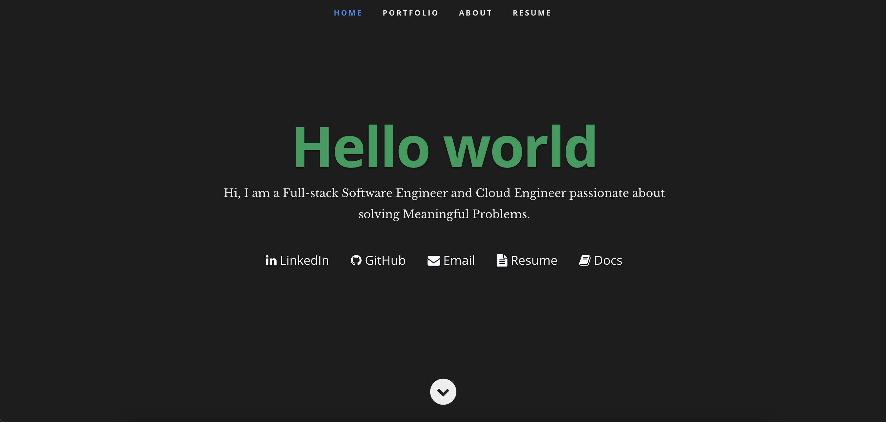

**_Established in 2013_**

I first bought my personal domain [www.evantay.com](https://www.evantay.com) way back in 2013. Younger me thought it would be cool and fun to run my own website, and it still is. :sunglasses:

To be honest, I can't even remember what my very first website looked like, but I am quite sure it was built using vanilla HTML and CSS, something unthinkable in this day and age.

<!--truncate-->

**_Move to Grav CMS in 2017_**

Given that I was building everything from the ground up, maintainability became problematic. In 2017, older younger me decided it wasn't worth the effort to do it myself, and I started shopping for a framework to adopt. I eventually settled on using  [Grav](https://getgrav.org/), a flat-file Content Management System (CMS) powered by PHP. I chose it because I was familiar and interested in PHP at the time.

To get started on building my second site quickly, I used a one-page Grav theme [Ceevee](https://github.com/getgrav/grav-theme-ceevee).

However, I still wanted to add my personal touch to my portfolio website. This led me to heavily modifying the theme numerous times over the years, from 2017 up until 2020. It was a really fun journey while it lasted.

**_Move to Cloud in 2017_**

About the same time, I also moved from using a website host to [DigitalOcean](https://digitalocean.com). I hosted my website on the cheapest droplet (VM) I could find (the 5 bucks one). I ran CentOS on the VM, and used an [Nginx](https://www.nginx.com/) web server to serve the Grav website. Pretty old-school right? 

**_Start of DigiDocs in 2019_**

Last year, during January 2019, I also started working on a separate pet project called [DigiDocs](https://digipie.github.io/digidocs/), my personal documentation website. I was motivated to do so because I wanted to consolidate useful knowledge gained from attending university classes, and my own self-directed learning. I kept the site updated up until October 2020.

Back then, [DigiDocs](https://digipie.github.io/digidocs/) lived at [www.evantay.com/docs](https://www.evantay.com/docs/), and was served by the same Nginx server which served my main portfolio website.

**_Move to Docusaurus v2 in 2020_**

More recently, in October 2020, I decided to replace both documentation and portfolio site with a single [Docusaurus v2](https://v2.docusaurus.io/) website (which you're looking at right now).

I did so because I wanted to:

1. **Keep up with the latest technologies**: I wanted to learn more about [Docusaurus v2](https://v2.docusaurus.io/) and also [ReactJS](https://reactjs.org/), which is what Docusaurus is built upon. It was about time to move on from PHP.
1. **Reduce operating costs by moving from a dynamic to static website** :money_with_wings: : Given that all of my content are static, it did not make sense that I was using a dynamic PHP site generator such as [Grav](https://getgrav.org/). By moving to a static website, I will be able to host my site at a cheaper cost or even for free! I am planning to achieve the latter by using [GitHub pages](https://pages.github.com/).

So far, the experience of using [Docusaurus v2](https://v2.docusaurus.io/) has been great! I am glad I started on this migration journey, despite feeling sentimental about my old portfolio and documentation websites.