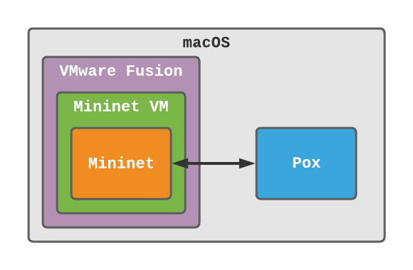

*This document was migrated from [DigiDocs](https://digipie.github.io/digidocs/mininet/getting-started/)*



In this section you will find my notes on:

1. Setting up and running Mininet VM on a virtualization program.
2. Setting up and running NOX/POX controller on your local machine.
3. Connecting your POX controller to your Mininet application (and troubleshooting).

:::note

I wrote this setup guide using MacOS, POX [using Python3](https://github.com/noxrepo/pox/issues/192), and VMware Fusion. However, the setup flow and troubleshooting should be similar for Linux/Window and other virtualization programs.

:::

## Set up Mininet VM

1. Download, setup and launch the latest Mininet VM [here](https://github.com/mininet/mininet/wiki/Mininet-VM-Images).
    - For virtualization program, try VirtualBox first given that it is free and open-source.
    - If you do use VirtualBox, remember to add a Host-only network adapter to your VM under  
    _Select VM > Settings > Network_
    - If you are on MacOS, and the Mininet VM aborts when you launch it (as it does for me), you may have to consider using [VMware Fusion](https://www.vmware.com/products/fusion.html) instead.
    - If you do use VMware Fusion, change your network adapter:  
    _Virtual Machine > Network Adapter > Bridged (Autodetect)_
2. Log into the VM using `mininet` as both username and password.

Before setting up the NOX/POX on your local machine, it would be best to familiarise and verify that your Mininet setup is working fine. Try out a few of the commands in [#mininet-cheat-sheet](#mininet-cheat-sheet) such as `pingall`.

## Set up POX

You will be setting up the NOX/POX controller on your local machine, and linking it up with the Mininet application in your VM.

Verify that your POX installation is working:

``` bash
git clone https://github.com/noxrepo/pox 
cd pox
./pox.py log.level --DEBUG
```

1. Verify that you see:   
`INFO:core:POX 0.7.0 (gar) is up.`
1. You can terminate POX after step 1.
1. If it does not work, it is likely because you do not have Python3 installed. You can  `git checkout master` to change to the Python2 version for POX. See [this](https://github.com/noxrepo/pox/issues/192) for more information.

## Connecting POX to Mininet VM

Next, we will set up a Mininet network (on your Mininet VM) with the remote controller set to the POX controller (on your local machine). To do so, you will need to open two terminals, one on your local machine where POX is at, and another terminal in your Mininet VM.

### Verify POX is reachable by VM

On your local machine, at the `pox/` directory:

``` bash
./pox.py log.level --DEBUG forwarding.l2_learning
```

1. Verify that you see something similar to:  
`DEBUG:openflow.of_01:Listening on 0.0.0.0:6633`

On your Mininet VM, check if your VM can reach the POX controller at the port it is listening on:

``` bash
nc -zvw10 0.0.0.0 6633
```

1. Replace the IP address and port with what you see after `Listening on` in the previous step.
2. Verify that you see something similar to:  
`Connection to 127.0.0.1 port 6633 [tcp/*] succeeded!`
3. If you see something like:  
`nc: connectx to 127.0.0.1 port 6633 (tcp) failed: Connection refused`,  
it is probably because your VM cannot access your host machine. See [#troubleshoot-connectivity](#troubleshoot-connectivity).

### Verify Mininet uses remote POX

Next, start Mininet with the controller set to your POX controller on your local machine:

```
sudo mn --controller=remote,ip=0.0.0.0,port=6633
```

1. Replace the IP address and port accordingly.

Lastly, check if your POX remote controller is connected:

``` bash
h1 ping h2
```

1. Verify that `h1` is able to ping `h2`. If not, your remote controller is not connected.
2. You should also see output in the POX window similar to:  
`DEBUG:forwarding.l2_learning:installing flow for 52:1e:48:64:23:43.2 -> 02:07:aa:33:88:e5.1`

If you are able to make it to this point, your setup for Mininet VM and remote POX is completed. See [#resources](#resources) for more information on what you can do next with Mininet!

## Mininet Cheat-sheet

#### Enter Mininet

``` bash
sudo mn
```

#### Display

Display all Mininet commands:

``` bash
help
```

Display all nodes:

``` bash
nodes
```

Display all links:

``` bash
net
```

Display information on everything:

``` bash
dump
```

#### Test connectivity

This command tests the connectivity between all hosts:

``` bash
pingall
```

#### Exit Mininet

``` bash
exit
sudo mn –c
```

1. `sudo mn -c` is used to clean up Mininet.

## Troubleshoot connectivity

If you are unable to connect to the POX controller from your VM, it could be one of the following problems:

1. Firewall rules are blocking it.
2. Incorrect IP address or port.


If you are certain you are specifiying the correct IP address and port, and that your firewall is off or allowing traffic in for the port POX is listening on, attempt the fix in [#vm-host-connectivity](#vm-host-connectivity).

### VM-Host connectivity

The instructions here are for VMware Fusion and MacOS, but you can use it as a guide for solving connectivity issues between Windows/Linux and VirtualBox/other virtualization programs too. See [this](https://stackoverflow.com/a/19824282) for more information.

On your local machine:

1. Turn off your Mininet VM:  
_Virtual Machine > Shutdown (for VMware Fusion)_
1. Change your network adapter to Bridged (Autodetect) if you have not done so yet:  
_Virtual Machine > Network Adapter > Bridged (Autodetect)_
1. Turn on your Mininet VM.
1. Find out your local machine's IP address:  
_System Preferences > Network > Wi-Fi_
1. Look out for something similar to:  
`Wi-Fi is connected to YourWifi and has the IP address 192.168.0.152`

On your Mininet VM:

Use your local machine's IP address for the `nc` command:  

```bash
nc -zvw10 192.168.0.152 6633
```

If this works, use this address instead of `127.0.0.1` or `0.0.0.0` whenever you are specifying the remote controller's IP address for Mininet.

```bash
sudo mn --controller=remote,ip=192.168.0.152,port=6633
```

## Resources

- [Original copy of this document at DigiDocs](https://digipie.github.io/digidocs/mininet/getting-started/)
- [Download/Get Started With Mininet](http://mininet.org/download/)
- [Mininet Walkthrough](http://mininet.org/walkthrough/)
- [NUS CS4226: A short walk-through of Mininet and POX](https://www.comp.nus.edu.sg/~tbma/teaching/cs4226y16_past/tutorial-Mininet-POX.pdf)
- [StackOverflow: VMWare fusion: connecting to host's web server from guest](https://stackoverflow.com/a/19824282)